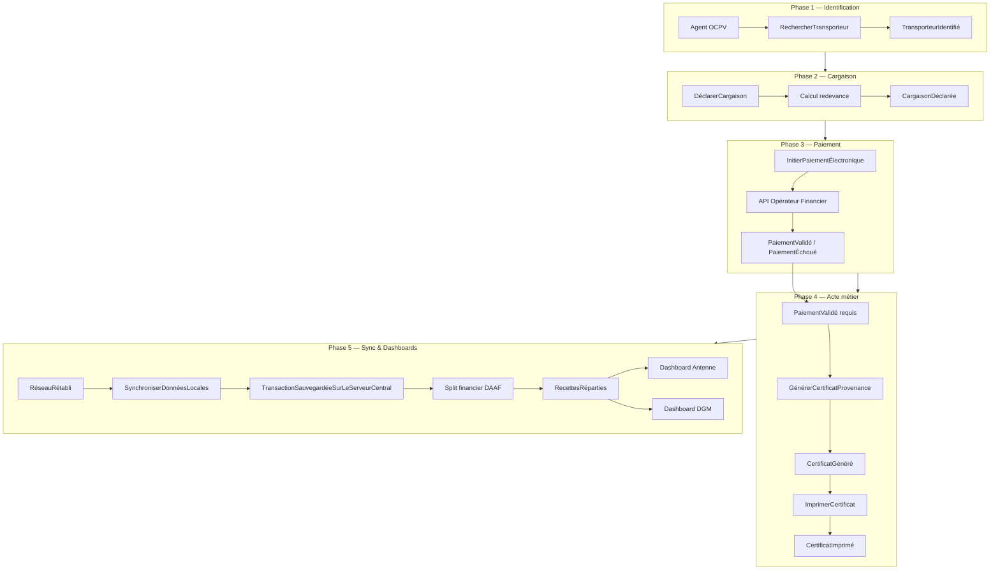

# React + Vite

This template provides a minimal setup to get React working in Vite with HMR and some ESLint rules.

Currently, two official plugins are available:

- [@vitejs/plugin-react](https://github.com/vitejs/vite-plugin-react/blob/main/packages/plugin-react) uses [Oxc](https://oxc.rs)
- [@vitejs/plugin-react-swc](https://github.com/vitejs/vite-plugin-react/blob/main/packages/plugin-react-swc) uses [SWC](https://swc.rs/)

## React Compiler

The React Compiler is not enabled on this template because of its impact on dev & build performances. To add it, see [this documentation](https://react.dev/learn/react-compiler/installation).

## Expanding the ESLint configuration

If you are developing a production application, we recommend using TypeScript with type-aware lint rules enabled. Check out the [TS template](https://github.com/vitejs/vite/tree/main/packages/create-vite/template-react-ts) for information on how to integrate TypeScript and [`typescript-eslint`](https://typescript-eslint.io) in your project.

J’ai parcouru les deux documents. Voici une synthèse structurée pour aligner la maquette actuelle avec la vision du projet.

---

## Vision du projet (TDR)

L’OCPV doit **dématérialiser** les actes métiers **CP** (Certificat de Provenance) et **APE** (Autorisation Préalable d’Exportation), aujourd’hui gérés en carnets papier, avec les risques associés : pertes, erreurs de calcul, détournements, suivi manuel des recettes.

**Objectifs clés :**
- Sécuriser les recettes des transactions CP/APE
- Suivre en temps réel les **flux physiques** (volumes vivriers) et **flux financiers**
- Disposer de statistiques fiables et d’une base de données centralisée

**Répartition automatique des recettes** (exigence DAAF) : **70 % Trésor / 15 % DGM / 10 % Antenne / 5 % Prestataire**

**Périmètre fonctionnel :**
| Domaine | Contenu |
|---|---|
| Actes métiers | CP + APE dématérialisés, reçus sécurisés avec vérification |
| Transactions | Mobile Money (Orange, MTN, Wave, Trésor Pay), calcul auto, traçabilité |
| Utilisateurs | Rôles (admin, superviseur, agent terrain, comptable…), affectation par antenne/poste |
| TPE | Déploiement terrain, statut online/offline, géolocalisation |
| Commercialisation | Flux distribution/export, prix marchés, synthèses périodiques |

**Contrainte majeure** : mode **offline-first** sur les TPE (connectivité variable aux corridors).

---

## Modèle métier (Event Storming — 5 phases)

---

## Où en est la maquette aujourd’hui

### `TpeMockup` — couverture partielle des phases 1 à 4

| Phase Event Storming | Maquette actuelle | Écart |
|---|---|---|
| 1 — Identification | Étape 1 : saisie plaque, transporteur simulé | Manque : recherche par téléphone, création nouveau transporteur, fiche historique |
| 2 — Cargaison | Étape 2 : produit + tonnage, calcul tarif | Manque : villes provenance/destination |
| 3 — Paiement | Étape 3 : 4 opérateurs, toggle offline | Manque : échec paiement, procédure USSD offline, appel API simulé |
| 4 — Certificat | Étape 4 : reçu thermique + QR + impression | Manque : distinction CP/APE, génération conditionnée à `PaiementValidé` |
| 5 — Sync | Non représenté | À ajouter côté architecture |

### `ArchitectureOCPV` — squelette de la phase 5

La cartographie pose déjà les **3 niveaux** du TDR :
- **DGM** → dashboard central, carte thermique, `RecettesRéparties`
- **Antennes** → supervision régionale, `TransactionSauvegardée`
- **TPE** → nœud terrain, `InitierPaiementÉlectronique`, offline-first
- **Backend Rust (Actix-Web)** → serveur central, sync, split financier

C’est une bonne base pour **vendre l’architecture** au client ; les dashboards ne sont pas encore maquettés.

---

## Trajectoire d’évolution recommandée

### Court terme — enrichir le TPE (fidélité métier)

1. **Phase 1** : branche « transporteur inconnu » → formulaire `EnregistrerNouveauTransporteur`
2. **Phase 2** : champs provenance/destination + affichage explicite de l’événement `CargaisonDéclarée`
3. **Phase 3** : scénario `PaiementÉchoué` + mode offline avec reçu USSD (pas seulement un bandeau rouge)
4. **Phase 4** : sélecteur CP vs APE, QR code « crypté » avec ID unique (`CertificatGénéré`)

### Moyen terme — compléter la cartographie

5. **Dashboard Antenne** (route `/dashboard-antenne`) : volumes du jour, TPE online/offline, transactions en attente de sync
6. **Dashboard DGM** (route `/dashboard-dgm`) : carte thermique des corridors, recettes globales, split 70/15/10/5
7. **Animation des flux** : au clic sur un nœud TPE, simuler la remontée `TransactionSauvegardée` → `RecettesRéparties` avec mise à jour visuelle des dashboards

### Long terme — alignement TDR complet

8. Module **administration** (utilisateurs, rôles, affectation TPE)
9. Module **APE** (workflow distinct du CP, validation export)
10. **Reporting** : exports Excel/PDF, filtres par région/poste/produit/période
11. Légende DDD sur la cartographie (couleurs Commande / Événement / Règle / Vue) pour lier maquette et event storming

---

## Principe directeur

La maquette actuelle est un **prototype de démonstration du parcours agent terrain** (phases 1–4). Le TDR et l’event storming montrent que la **vraie valeur** du système est dans la **chaîne complète** :

> TPE offline-capable → sync central → répartition DAAF → pilotage DGM/Antennes

La cartographie `ArchitectureOCPV` est le bon fil conducteur pour faire évoluer la maquette vers une **démo intégrée** plutôt qu’un simple écran TPE isolé.

---

Dis-moi par quoi tu veux commencer : enrichissement du workflow TPE (phases manquantes), maquette d’un dashboard Antenne ou DGM, ou animation des flux entre les nœuds de la cartographie.J’ai parcouru les deux documents. Voici une synthèse structurée pour aligner la maquette actuelle avec la vision du projet.

---

## Vision du projet (TDR)

L’OCPV doit **dématérialiser** les actes métiers **CP** (Certificat de Provenance) et **APE** (Autorisation Préalable d’Exportation), aujourd’hui gérés en carnets papier, avec les risques associés : pertes, erreurs de calcul, détournements, suivi manuel des recettes.

**Objectifs clés :**
- Sécuriser les recettes des transactions CP/APE
- Suivre en temps réel les **flux physiques** (volumes vivriers) et **flux financiers**
- Disposer de statistiques fiables et d’une base de données centralisée

**Répartition automatique des recettes** (exigence DAAF) : **70 % Trésor / 15 % DGM / 10 % Antenne / 5 % Prestataire**

**Périmètre fonctionnel :**
| Domaine | Contenu |
|---|---|
| Actes métiers | CP + APE dématérialisés, reçus sécurisés avec vérification |
| Transactions | Mobile Money (Orange, MTN, Wave, Trésor Pay), calcul auto, traçabilité |
| Utilisateurs | Rôles (admin, superviseur, agent terrain, comptable…), affectation par antenne/poste |
| TPE | Déploiement terrain, statut online/offline, géolocalisation |
| Commercialisation | Flux distribution/export, prix marchés, synthèses périodiques |

**Contrainte majeure** : mode **offline-first** sur les TPE (connectivité variable aux corridors).

---

## Modèle métier (Event Storming — 5 phases)

---

## Où en est la maquette aujourd’hui

### `TpeMockup` — couverture partielle des phases 1 à 4

| Phase Event Storming | Maquette actuelle | Écart |
|---|---|---|
| 1 — Identification | Étape 1 : saisie plaque, transporteur simulé | Manque : recherche par téléphone, création nouveau transporteur, fiche historique |
| 2 — Cargaison | Étape 2 : produit + tonnage, calcul tarif | Manque : villes provenance/destination |
| 3 — Paiement | Étape 3 : 4 opérateurs, toggle offline | Manque : échec paiement, procédure USSD offline, appel API simulé |
| 4 — Certificat | Étape 4 : reçu thermique + QR + impression | Manque : distinction CP/APE, génération conditionnée à `PaiementValidé` |
| 5 — Sync | Non représenté | À ajouter côté architecture |

### `ArchitectureOCPV` — squelette de la phase 5

La cartographie pose déjà les **3 niveaux** du TDR :
- **DGM** → dashboard central, carte thermique, `RecettesRéparties`
- **Antennes** → supervision régionale, `TransactionSauvegardée`
- **TPE** → nœud terrain, `InitierPaiementÉlectronique`, offline-first
- **Backend Rust (Actix-Web)** → serveur central, sync, split financier

C’est une bonne base pour **vendre l’architecture** au client ; les dashboards ne sont pas encore maquettés.

---

## Trajectoire d’évolution recommandée

### Court terme — enrichir le TPE (fidélité métier)

1. **Phase 1** : branche « transporteur inconnu » → formulaire `EnregistrerNouveauTransporteur`
2. **Phase 2** : champs provenance/destination + affichage explicite de l’événement `CargaisonDéclarée`
3. **Phase 3** : scénario `PaiementÉchoué` + mode offline avec reçu USSD (pas seulement un bandeau rouge)
4. **Phase 4** : sélecteur CP vs APE, QR code « crypté » avec ID unique (`CertificatGénéré`)

### Moyen terme — compléter la cartographie

5. **Dashboard Antenne** (route `/dashboard-antenne`) : volumes du jour, TPE online/offline, transactions en attente de sync
6. **Dashboard DGM** (route `/dashboard-dgm`) : carte thermique des corridors, recettes globales, split 70/15/10/5
7. **Animation des flux** : au clic sur un nœud TPE, simuler la remontée `TransactionSauvegardée` → `RecettesRéparties` avec mise à jour visuelle des dashboards

### Long terme — alignement TDR complet

8. Module **administration** (utilisateurs, rôles, affectation TPE)
9. Module **APE** (workflow distinct du CP, validation export)
10. **Reporting** : exports Excel/PDF, filtres par région/poste/produit/période
11. Légende DDD sur la cartographie (couleurs Commande / Événement / Règle / Vue) pour lier maquette et event storming

---

## Principe directeur

La maquette actuelle est un **prototype de démonstration du parcours agent terrain** (phases 1–4). Le TDR et l’event storming montrent que la **vraie valeur** du système est dans la **chaîne complète** :

> TPE offline-capable → sync central → répartition DAAF → pilotage DGM/Antennes

La cartographie `ArchitectureOCPV` est le bon fil conducteur pour faire évoluer la maquette vers une **démo intégrée** plutôt qu’un simple écran TPE isolé.

---

Dis-moi par quoi tu veux commencer : enrichissement du workflow TPE (phases manquantes), maquette d’un dashboard Antenne ou DGM, ou animation des flux entre les nœuds de la cartographie.